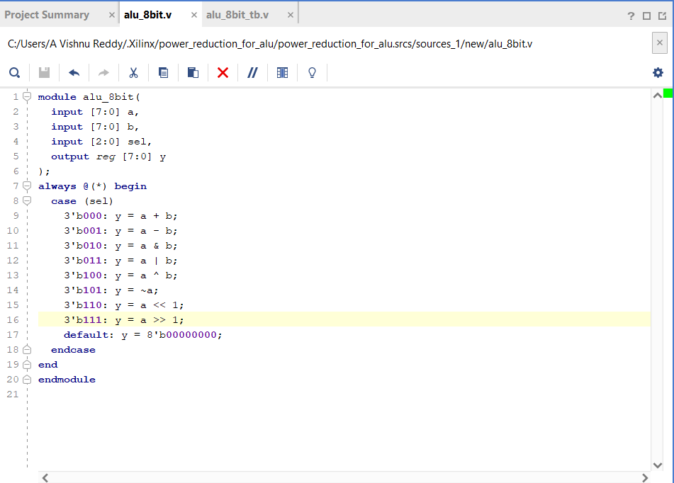
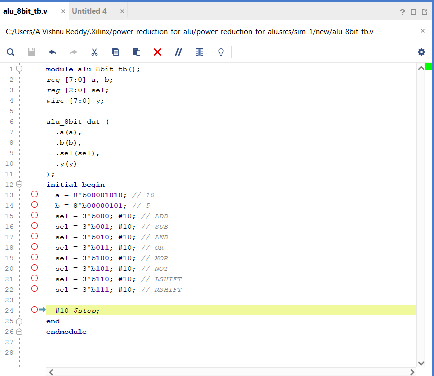
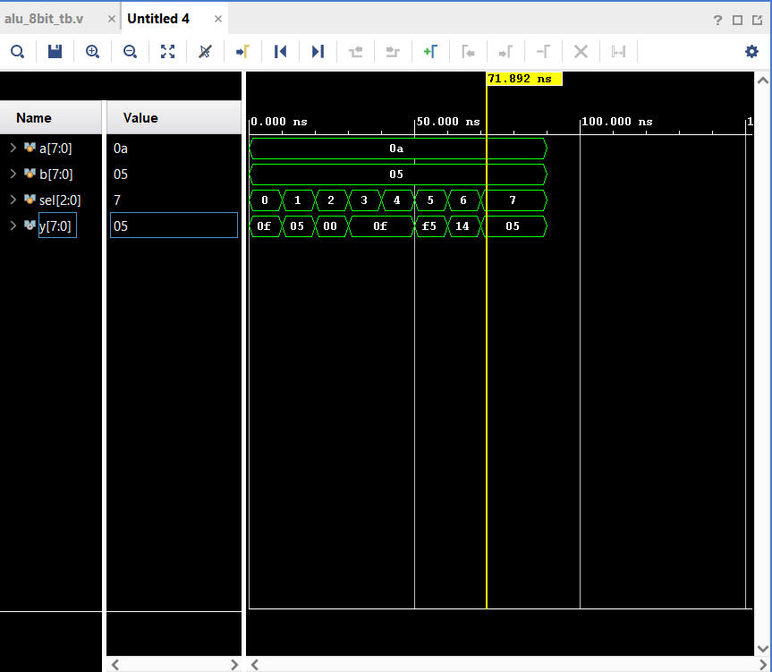
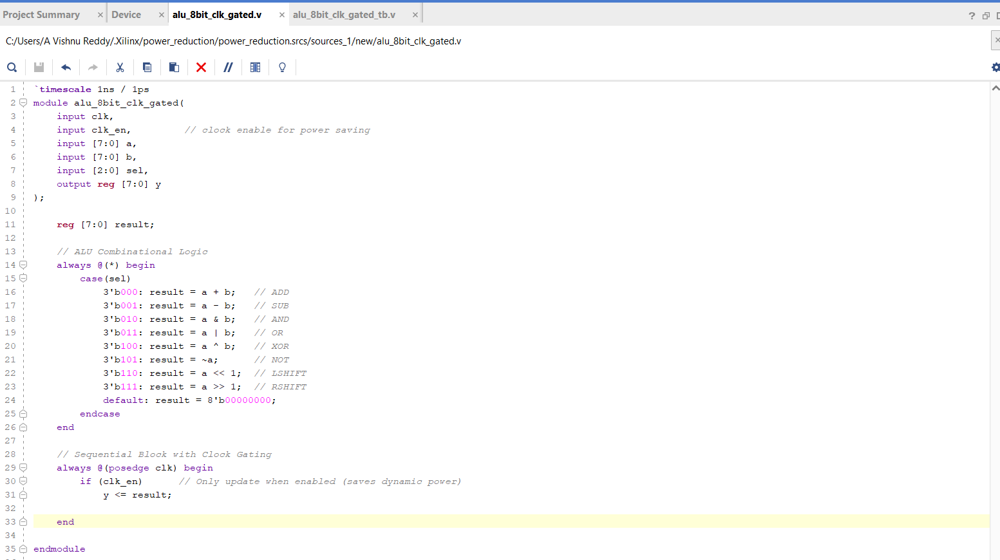
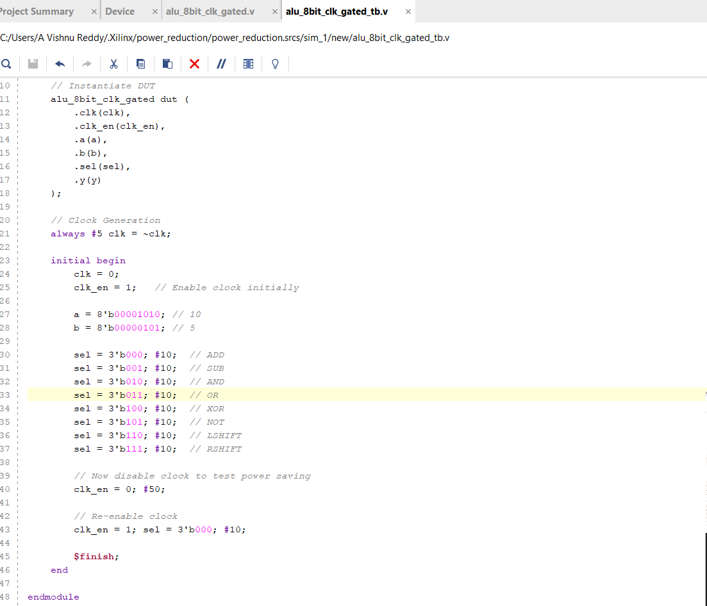
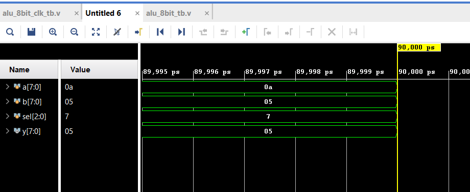
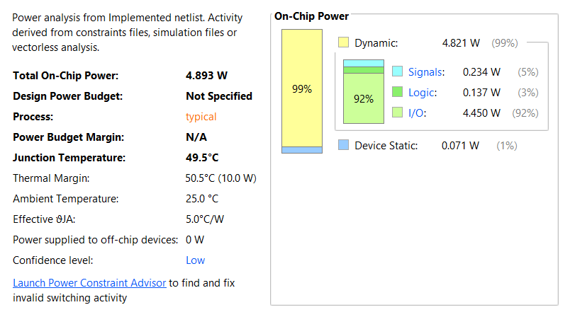

Power-Efficient-8-bit-ALU-Design-using-Clock-Gating-in-Verilog
This project implements an 8-bit Arithmetic Logic Unit (ALU) in Verilog using Xilinx Vivado. 
The design demonstrates power reduction techniques by comparing a normal ALU with a clock-gated ALU.
Normal ALU: Standard implementation without power optimization.

Clock-Gated ALU: Uses clock enable (CE) and operand isolation to reduce unnecessary switching activity, lowering dynamic power consumption.

8-bit ALU supporting operations:

Addition
Subtraction
AND, OR, XOR, NOT
Left Shift, Right Shift

Tools Used
Xilinx Vivado (WebPACK Edition)
Verilog HDL
ModelSim / Vivado Simulator for functional simulation

## 🔬 Simulation Results
### Normal ALU

### Clock-Gated ALU

## ⚡ Power Analysis
### Normal ALU Power Report

### Clock-Gated ALU Power Report

